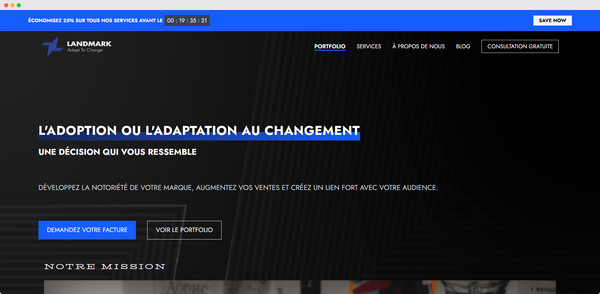

# 📈 LandMark – Marketing Agency Website
<p align="center">
    
</p>

<p align="center">
    <em>This is the logo of LandMark agency.</em>
</p>
LandMark is a modern, responsive website built for a marketing agency. This project showcases services, client success stories, project portfolios, blog content, and more — all designed with a sleek, professional look and optimized for user experience.

---

## 🚀 Project Overview

This React-based web application was originally migrated from a Blade-based (Laravel) project to a modular, component-driven architecture using:

- ⚛️ **React JS (Vite)**
- 🎨 **Tailwind CSS**
- 👨🏻‍💻 **Laravel**
- 🧩 Modular component structure (reusable components)
- ✅ Follows accessibility best practices and W3C standards

---

## 🧱 Features

- 🔝 Promotion banner for deals or calls-to-action
- 🧭 Responsive Navbar with branding
- 🎯 Hero section with mission & company goals
- 🛠 Services section outlining agency offerings
- 📁 Projects portfolio display
- ✍️ Informative Blog page
- 👤 Client Reviews section
- 📞 Contact form
- ❓ FAQ section
- 👣 Footer with social/contact links
- 🧠 Clean and readable component structure

---

## 📁 File Structure

```
src/
├── assets/                # Backgrounds, images, icons
├── components/            # All UI components (Nav, Footer, etc.)
│   ├── Head.jsx
│   ├── Nav.jsx
│   ├── Promotion.jsx
│   ├── Hero.jsx
│   ├── Mission.jsx
│   ├── Services.jsx
│   ├── Projects.jsx
│   ├── Content.jsx
│   ├── Reviews.jsx
│   ├── Contact.jsx
│   ├── Blog.jsx
│   ├── FAQ.jsx
│   └── Footer.jsx
├── pages/
│   └── Home.jsx           # Main page using all components
├── App.jsx
└── main.jsx
```

---

## 🛠 Getting Started

### Prerequisites

- Node.js (v16 or above)
- npm or yarn

### Installation

```bash
git clone https://github.com/LatrachDev/Land-Mark-Agency.git
cd Land-Mark-Agency/frontend
npm install
```

### Development Server

```bash
npm run dev
```

Visit `http://localhost:5173` to view the app.

---

## 🧪 Technologies Used
### Front-end
- React JS (Vite)
- Tailwind CSS
- HTML5 & JSX
- CSS3
### Back-end
- Laravel 
### Web design
- Figma (for UI/UX design)
### Other tools
- Git
- GitHub for version control
- Jira for task management

---

## 📌 Project Status

✅ MVP complete  
🔄 Ongoing improvements:   
- Contact form backend integration  
- SEO optimization  
- Accessibility audit

---

## 💡 Inspiration & Goal

LandMark aims to provide a professional online presence for modern marketing agencies. This project focuses on performance, clarity, and effective content structure to convert visitors into clients.

---

## 📷 Preview

> 

---

## 🤝 Contributing

Pull requests are welcome! For major changes, please open an issue first to discuss what you would like to change.

---

## 📄 License

MIT License © 2025 [MOHAMMED LATRACH]

---

## 📬 Contact

For questions or collaborations, reach out to [m.latrach.youcode@gmail.com].
